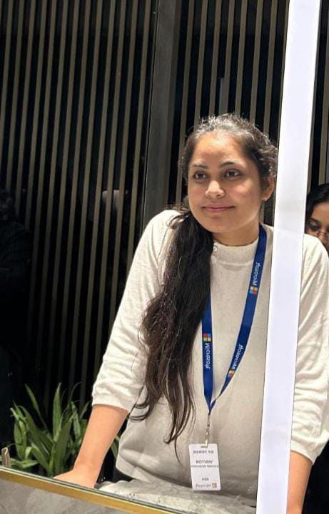

# Sneha Kalra - Full Stack Portfolio 🚀

Welcome to my personal portfolio repository! This is a modern, responsive, and high-performance web application designed to showcase my journey as a Full Stack Developer, my technical skills, and the projects I've built.



## 👤 About Me

I'm **Sneha Kalra**, a third-year B.Tech student in Information Technology at MSIT Delhi. I specialize in building fast, scalable, and aesthetically pleasing web applications.

- 🎓 **CGPA**: 9.08
- 🏆 **Reliance Foundation Scholar** (Top 5,000 out of 2.5L+ applicants)
- 💻 **Open Source**: 12+ PRs merged in GSSoC 2024
- 🚩 **Hackathons**: 10+ Participated, 2x Semi-Finalist
- 🤝 **Mentorship**: Mentored 30+ students at Women Who Code

## 🛠️ Tech Stack

### Frontend


### Backend & Databases


### Languages & Tools


## 📂 Featured Projects

1.  **HackXplore**: A unified platform to discover hackathons and internships with AI-based recommendations and intelligent teammate matching.
2.  **TrackSafe**: Advanced real-time accident detection and emergency response system using geolocation.
3.  **Employee Management System**: Full-stack HR platform with complete CRUD, advanced filtering, and a training module.
4.  **Quantarax**: Quantitative analysis platform for smart, data-driven research insights.

## 🚀 Getting Started

To run this portfolio locally, follow these steps:

1.  **Clone the repository**:
    ```bash
    git clone https://github.com/sneha-860/portfolio.git
    ```
2.  **Navigate to the project directory**:
    ```bash
    cd portfolio
    ```
3.  **Open `index.html`** in your preferred browser.

## 📈 Experience

- **Software Development Intern** @ Exicom Tele-Systems Ltd. (2025)
- **Open Source Contributor** @ GirlScript Summer of Code 2024
- **Hackathon Competitor & Builder** (Various National Hackathons)

## 📫 Connect with Me

Let's build something amazing together!

[](https://www.linkedin.com/in/sneha-kalra-5b4999281)
[](https://x.com/snehakalra74)
[](https://github.com/sneha-860)
[](mailto:snehakalra218@gmail.com)

---
Designed & Developed with ❤️ by **Sneha Kalra**
